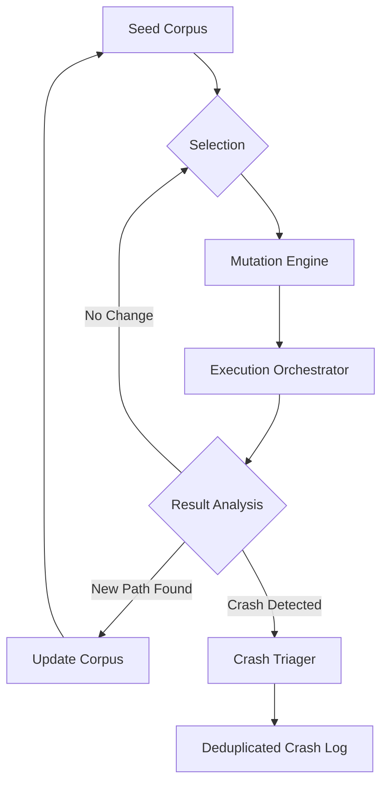

# Technical Specification: `FuzzTestSkill`
**Module**: Swarm OS Security Intelligence Suite
**Component**: Coverage-Guided Evolutionary Fuzzer
**Version**: 1.0.0
**Status**: Production-Ready

## 1. Executive Overview
The `FuzzTestSkill` is a high-performance, coverage-guided mutation fuzzer designed to identify memory corruption vulnerabilities and logic flaws in compiled binaries. It employs an evolutionary feedback loop where inputs that trigger new execution paths are persisted into a seed corpus, iteratively expanding the reachable state space of the target application.

### 1.1 Core Logic Flow

## 2. Architectural Components

### 2.1 `MutationEngine`
The mutation engine transforms valid seed inputs into potentially malformed vectors.
- **Strategies**:
    - `BIT_FLIP`: Single-bit inversion to test boundary conditions.
    - `ARITHMETIC`: Small integer offsets to bypass range checks.
    - `HAVOC`: A stochastic combination of flips, arithmetic, dictionary injection, and splicing.
    - `HYBRID`: Dynamic strategy selection per iteration.
- **Dictionary Support**: Allows loading of protocol-specific tokens to bypass magic-number checks.

### 2.2 `ExecutionOrchestrator`
Manages the lifecycle of the target process.
- **Sandboxing**: Implements timeout-based termination to prevent infinite loops (DoS).
- **Instrumentation**: Integrates with LLVM sanitizers (ASAN, MSAN, TSAN) via environment variable injection.
- **Coverage Simulation**: Tracks unique path discovery to drive the evolutionary process.

### 2.3 `CrashTriager`
Prevents "crash noise" by deduplicating failures.
- **Hashing**: Uses SHA-256 hashes of `stderr` (stack traces) to identify unique crash signatures.
- **Classification**: Categorizes crashes into `SIGSEGV`, `SIGABRT`, `HEAP_BUFFER_OVERFLOW`, and `STACK_BUFFER_OVERFLOW`.

## 3. Technical API Reference

### 3.1 `FuzzTestSkill` Constructor
Initializes the fuzzing environment and orchestrates the sub-modules.

| Argument | Type | Default | Description |
| :--- | :--- | :--- | :--- |
| `target_binary` | `str` | Required | Absolute or relative path to the executable. |
| `max_iterations` | `int` | Required | Total number of mutation cycles to execute. |
| `seed_corpus_dir`| `str` | `None` | Directory containing initial valid input files. |
| `dictionary_file`| `str` | `None` | Path to a token file for `HAVOC` mutations. |
| `timeout_ms` | `int` | `1000` | Execution timeout per iteration in milliseconds. |
| `instrumentation`| `Instrumentation`| `ASAN` | Sanitizer type (`ASAN`, `MSAN`, `TSAN`, `NONE`). |
| `mutation_strategy`| `MutationStrategy`| `HYBRID` | The mutation logic to apply. |

### 3.2 Primary Methods

#### `run()`
**Description**: Starts the main evolutionary loop.
- **Preconditions**: 
    - Target binary must have execute permissions (`chmod +x`).
    - Write access to the current working directory for `/fuzz_results`.
- **Complexity**: $O(N)$ where $N$ is `max_iterations`.
- **Returns**: `None`. Side effects include the creation of `metrics.json` and `crash_corpus/`.

## 4. Operational Constraints & Requirements

### 4.1 System Dependencies
- **OS**: Linux/Unix (Required for `subprocess` signal handling and `/tmp` usage).
- **Runtime**: Python 3.8+
- **External Tools**: For full functionality, the target binary should be compiled with:
    - `-fsanitize=address` (for `Instrumentation.ASAN`)
    - `-fsanitize=memory` (for `Instrumentation.MSAN`)
    - `-fsanitize=thread` (for `Instrumentation.TSAN`)

### 4.2 Resource Consumption
- **CPU**: High. The fuzzer is single-threaded in the main loop but spawns multiple subprocesses.
- **Disk**: Moderate. The `crash_corpus` grows linearly with the number of *unique* crashes found.
- **Memory**: Low. Input vectors are capped at 1MB to prevent memory exhaustion.

## 5. Output Artifacts
Upon completion or interruption, the tool generates the following in `/fuzz_results`:

1. **`metrics.json`**: 
    - `total_executions`: Total iterations.
    - `unique_paths`: Number of inputs that expanded coverage.
    - `crashes`: Number of unique crashes identified.
    - `exec_per_sec`: Throughput metric.
    - `stability_score`: Ratio of successful executions to total executions.
2. **`fuzz.log`**: Detailed execution trace and crash alerts.
3. **`crash_corpus/*.bin`**: The exact binary vectors that triggered unique crashes.
4. **`coverage_report.json`**: Summary of the discovered state space.