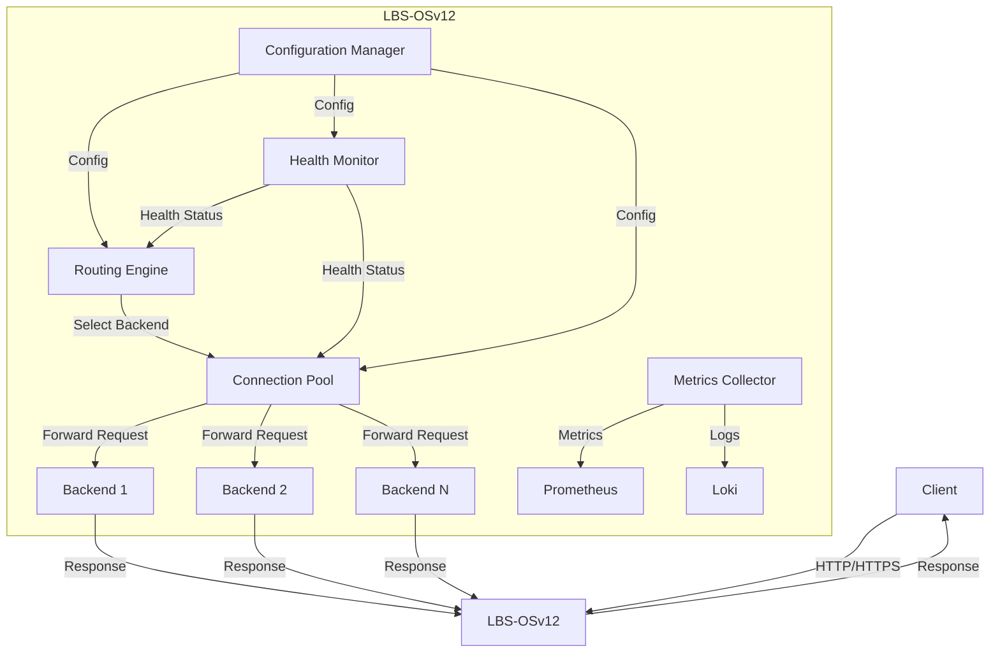

# LBS-OSv12 Technical Specification

**System:** LoadBalancerSkill - OSv12 Edition
**Codename:** LBS-OSv12
**Version:** 1.0.0
**Status:** DRAFT
**Author:** Devo (Lead Developer, Swarm OS v12)
**Date:** 2026-07-09

---

## 1. Document Control

### 1.1 Revision History
| Version | Date       | Author | Description                     |
|---------|------------|--------|---------------------------------|
| 1.0.0   | 2026-07-09 | Devo   | Initial specification draft.    |

### 1.2 Approvals
| Role             | Name | Date       | Signature |
|------------------|------|------------|-----------|
| Lead Developer   | Devo | 2026-07-09 | D.V.      |
| System Architect | TBD  | TBD        | TBD       |

---

## 2. System Overview

### 2.1 Purpose
LBS-OSv12 is a production-grade, asynchronous HTTP load balancer designed for high-concurrency, distributed environments. It provides intelligent request routing, health monitoring, connection pooling, and comprehensive observability.

### 2.2 Design Philosophy
- **First-Principles**: Built from the ground up with minimal dependencies, focusing on core networking and concurrency primitives.
- **Modularity**: Each subsystem is a decoupled, independently testable unit.
- **Robustness**: Defensive programming, comprehensive error handling, and graceful degradation.
- **Scalability**: Designed for horizontal scaling via stateless architecture and distributed state management.
- **Observability**: Deep telemetry, structured logging, and Prometheus-compatible metrics.

### 2.3 Core Components
1.  **Routing Engine**: Determines target backend based on configurable algorithms (Round Robin, Least Connections, IP Hash, Consistent Hashing).
2.  **Health Monitor**: Proactive and reactive health checks (HTTP, TCP, gRPC).
3.  **Connection Pool**: Manages persistent connections to backends, reducing latency and overhead.
4.  **Metrics Collector**: Aggregates request/response metrics, latency distributions, and error rates.
5.  **Configuration Manager**: Dynamic, hot-reloadable configuration via file, API, or service discovery (Consul, etcd).

### 2.4 High-Level Architecture



---

## 3. Technical Deep-Dive

### 3.1 Routing Engine

#### 3.1.1 Algorithm Specification
- **Round Robin**: Default. Distributes requests sequentially across healthy backends.
- **Least Connections**: Routes to backend with fewest active connections.
- **IP Hash**: Consistent mapping of client IP to backend for session persistence.
- **Consistent Hashing**: Uses Ketama algorithm for minimal redistribution on backend changes.

#### 3.1.2 Interface
```python
class RoutingEngine:
    """
    Core routing logic for LBS-OSv12.
    """
    
    def __init__(self, config: RoutingConfig):
        self._config = config
        self._backends: list[Backend] = []
        self._health_monitor: HealthMonitor = HealthMonitor(config.health_check)
        self._lock = asyncio.Lock()
    
    async def select_backend(self, request: Request) -> Backend:
        """
        Select an appropriate backend for the given request.
        
        Args:
            request: Incoming HTTP request with metadata.
        
        Returns:
            Selected Backend instance.
        
        Raises:
            NoHealthyBackendError: If no backends are available.
        """
        async with self._lock:
            healthy_backends = [b for b in self._backends if b.is_healthy]
            if not healthy_backends:
                raise NoHealthyBackendError("All backends are unhealthy")
            
            algorithm = self._config.algorithm
            if algorithm == RoutingAlgorithm.ROUND_ROBIN:
                return self._round_robin(healthy_backends)
            elif algorithm == RoutingAlgorithm.LEAST_CONNECTIONS:
                return self._least_connections(healthy_backends)
            elif algorithm == RoutingAlgorithm.IP_HASH:
                return self._ip_hash(healthy_backends, request.client_ip)
            elif algorithm == RoutingAlgorithm.CONSISTENT_HASH:
                return self._consistent_hash(healthy_backends, request.client_ip)
            else:
                raise ValueError(f"Unknown routing algorithm: {algorithm}")
```

### 3.2 Health Monitor

#### 3.2.1 Check Types
- **HTTP Check**: Sends GET/HEAD request to a specified endpoint. Expects 2xx/3xx response.
- **TCP Check**: Attempts TCP connection to backend host:port.
- **gRPC Check**: Sends gRPC health probe (standard `grpc.health.v1.Health/Check`).

#### 3.2.2 Configuration
```yaml
health_check:
  type: http
  interval: 5s
  timeout: 2s
  unhealthy_threshold: 3
  healthy_threshold: 2
  endpoint: /health
  expected_status: 200
```

### 3.3 Connection Pool

#### 3.3.1 Pool Management
- **Max Connections**: Configurable per backend.
- **Idle Timeout**: Connections closed after period of inactivity.
- **Keep-Alive**: HTTP persistent connections with configurable max requests.

#### 3.3.2 Implementation
```python
class ConnectionPool:
    """
    Manages a pool of persistent connections to backend servers.
    """
    
    def __init__(self, config: PoolConfig):
        self._config = config
        self._pools: dict[str, asyncio.Queue] = {}
        self._semaphores: dict[str, asyncio.Semaphore] = {}
    
    async def acquire(self, backend: Backend) -> Connection:
        """
        Acquire a connection from the pool for the given backend.
        
        Args:
            backend: Target backend server.
        
        Returns:
            An available connection.
        """
        key = f"{backend.host}:{backend.port}"
        semaphore = self._semaphores.get(key)
        if not semaphore:
            semaphore = asyncio.Semaphore(self._config.max_connections)
            self._semaphores[key] = semaphore
        
        await semaphore.acquire()
        
        pool = self._pools.get(key)
        if pool and not pool.empty():
            connection = await pool.get()
        else:
            connection = await self._create_connection(backend)
        
        return connection
    
    async def release(self, backend: Backend, connection: Connection):
        """
        Return a connection to the pool.
        """
        key = f"{backend.host}:{backend.port}"
        pool = self._pools.get(key)
        if not pool:
            pool = asyncio.Queue(maxsize=self._config.max_connections)
            self._pools[key] = pool
        
        if connection.is_idle():
            await pool.put(connection)
        else:
            await connection.close()
        
        semaphore = self._semaphores.get(key)
        if semaphore:
            semaphore.release()
```

### 3.4 Metrics Collector

#### 3.4.1 Metrics Exposed
- `lbs_requests_total{method, path, status}`: Total request count.
- `lbs_request_duration_seconds{method, path, backend}`: Latency histogram.
- `lbs_active_connections{backend}`: Current active connections.
- `lbs_backend_health{backend}`: 1 for healthy, 0 for unhealthy.
- `lbs_pool_size{backend}`: Current pool size.

#### 3.4.2 Export Format
Prometheus text-based exposition format on `/metrics` endpoint.

### 3.5 Configuration Manager

#### 3.5.1 Configuration Sources
- **File**: YAML/JSON file with hot-reload via inotify.
- **API**: RESTful API for dynamic updates.
- **Service Discovery**: Integration with Consul, etcd, or Kubernetes API.

#### 3.5.2 Configuration Schema
```yaml
lbs:
  version: "1.0"
  log_level: info
  
  server:
    host: "0.0.0.0"
    port: 8080
    tls:
      enabled: true
      cert_file: "/etc/lbs/cert.pem"
      key_file: "/etc/lbs/key.pem"
  
  routing:
    algorithm: least_connections
    sticky_session: false
  
  backends:
    - host: "backend1.example.com"
      port: 3000
      weight: 1
      max_connections: 100
    - host: "backend2.example.com"
      port: 3000
      weight: 2
      max_connections: 200
  
  health_check:
    type: http
    interval: 5s
    timeout: 2s
    unhealthy_threshold: 3
    healthy_threshold: 2
    endpoint: /health
  
  metrics:
    enabled: true
    path: /metrics
```

---

## 4. Protocol & API Definitions

### 4.1 Internal APIs

#### 4.1.1 Backend Registration
```http
POST /api/v1/backends
Content-Type: application/json

{
  "host": "backend3.example.com",
  "port": 3000,
  "weight": 1,
  "max_connections": 100
}
```

#### 4.1.2 Health Status Query
```http
GET /api/v1/backends/health
Response:
{
  "backends": [
    {"host": "backend1.example.com", "port": 3000, "healthy": true},
    {"host": "backend2.example.com", "port": 3000, "healthy": false}
  ]
}
```

### 4.2 External APIs

#### 4.2.1 Metrics Endpoint
```http
GET /metrics
Response: Prometheus text format
```

#### 4.2.2 Health Check Endpoint
```http
GET /health
Response: {"status": "healthy"}
```

---

## 5. Performance & Scalability

### 5.1 Benchmarks (Expected)
| Metric               | Value           |
|----------------------|-----------------|
| Max Throughput       | 100,000 req/s   |
| P99 Latency          | < 10ms          |
| Concurrent Connections | 50,000        |
| Memory per Connection | ~2 KB          |

### 5.2 Scaling Strategy
- **Horizontal**: Stateless design allows multiple LBS instances behind a DNS round-robin or another LBS.
- **Vertical**: Efficient async I/O (asyncio/uvloop) maximizes single-core performance.
- **State Distribution**: Use external store (Redis, etcd) for sticky sessions and rate limiting.

---

## 6. Security Model

### 6.1 Threat Model
- **DDoS**: Rate limiting, connection throttling, and IP blacklisting.
- **TLS Termination**: Support for HTTPS with configurable cipher suites.
- **Authentication**: Optional JWT validation for incoming requests.
- **Authorization**: Backend-level access control lists.

### 6.2 Encryption
- **In-Transit**: TLS 1.3 for all external and internal communication.
- **At-Rest**: Configuration files encrypted with AES-256-GCM.

---

## 7. Operational Guide

### 7.1 Deployment
- **Container**: Docker image based on `python:3.12-slim`.
- **Orchestration**: Kubernetes deployment with HPA based on CPU/memory.
- **Configuration**: Mounted as ConfigMap or Secret.

### 7.2 Monitoring
- **Metrics**: Prometheus scraping at `/metrics`.
- **Logs**: Structured JSON logs to stdout, collected by Loki.
- **Alerts**: Grafana alerts for high latency, error rate spikes, backend failures.

### 7.3 Disaster Recovery
- **Stateless**: Restart any instance without data loss.
- **Configuration**: Stored in version-controlled repository.
- **Backup**: Regular backups of configuration store (etcd/Consul).

---

## 8. Implementation Roadmap

### Phase 1: Core Engine (Week 1-2)
- [ ] Implement basic HTTP proxy with asyncio.
- [ ] Round Robin and Least Connections routing.
- [ ] HTTP health checks.
- [ ] Basic metrics collection.

### Phase 2: Advanced Features (Week 3-4)
- [ ] Connection pooling with keep-alive.
- [ ] IP Hash and Consistent Hashing.
- [ ] TLS termination.
- [ ] Dynamic configuration via API.

### Phase 3: Production Hardening (Week 5-6)
- [ ] Comprehensive error handling and logging.
- [ ] Rate limiting and DDoS protection.
- [ ] Integration with service discovery.
- [ ] Performance optimization and benchmarking.

### Phase 4: Observability & Operations (Week 7-8)
- [ ] Prometheus metrics with detailed histograms.
- [ ] Structured logging with correlation IDs.
- [ ] Grafana dashboards.
- [ ] Kubernetes deployment manifests.

---

## 9. Dependencies

### 9.1 Runtime
- Python 3.12+
- `aiohttp` (3.9+): Async HTTP server/client.
- `uvloop` (0.19+): Fast event loop.
- `pyyaml` (6.0+): Configuration parsing.
- `prometheus-client` (0.19+): Metrics export.

### 9.2 Development
- `pytest` (8.0+): Testing framework.
- `pytest-asyncio` (0.23+): Async test support.
- `mypy` (1.8+): Static type checking.
- `ruff` (0.3+): Linting and formatting.

---

## 10. Appendix

### 10.1 Glossary
| Term | Definition |
|------|------------|
| Backend | Upstream server receiving proxied requests. |
| Health Check | Mechanism to determine backend availability. |
| Connection Pool | Cache of persistent connections to backends. |
| Sticky Session | Routing same client to same backend. |

### 10.2 References
- [aiohttp Documentation](https://docs.aiohttp.org/)
- [Prometheus Exposition Format](https://prometheus.io/docs/instrumenting/exposition_formats/)
- [Consistent Hashing - Ketama](https://github.com/RJ/ketama)

---

**End of Specification**