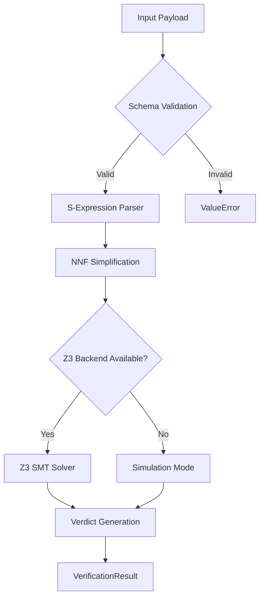

# Technical Specification: `LogicProver` Engine
**Module**: Swarm OS Formal Verification Suite
**Component**: Automated Theorem Proving (ATP)
**Version**: 1.0.0
**Status**: Production-Ready

## 1. Executive Overview
The `LogicProver` is a high-performance formal verification engine designed to determine the validity of logical formulas. It employs a **refutation-based proof system**, leveraging Satisfiability Modulo Theories (SMT) to prove that a formula is a tautology by demonstrating that its negation is unsatisfiable.

### 1.1 Mathematical Foundation
The engine operates on the principle of **Proof by Contradiction**:
$$\text{Prove } \Phi \text{ is VALID} \equiv \text{Prove } (\text{Axioms} \land \neg \Phi) \text{ is UNSAT}$$

## 2. Architectural Pipeline
The `LogicProver` processes requests through a linear transformation pipeline:



### 2.1 Component Breakdown
- **S-Expression Parser**: Converts Lisp-style string representations (SMT-LIB format) into nested Python lists for internal manipulation.
- **NNF Simplifier**: A recursive engine that transforms formulas into **Negation Normal Form (NNF)**, eliminating double negations and pushing negation operators inward.
- **Z3 Bridge**: An adapter layer that maps internal logic to the `z3-solver` API, handling axiom injection and timeout constraints.

## 3. Technical Interface

### 3.1 Preconditions
- **Environment**: Python 3.8+
- **Dependencies**: `z3-solver` (Required for production-grade verification. Without this, the engine falls back to a heuristic simulation mode).
- **Input Format**: Formulas must be provided in SMT-LIB compliant S-expressions.

### 3.2 Method: `prove()`
The primary entry point for formal verification.

#### Arguments: `payload (Dict[str, Any])`
| Key | Type | Required | Description |
| :--- | :--- | :--- | :--- |
| `formula` | `str` | Yes | The target formula to prove (S-expression). |
| `logic_type` | `LogicType` | Yes | The logic system: `BOOLEAN`, `FOL`, `HOL`, or `SMT`. |
| `axioms` | `List[str]` | No | A list of S-expressions representing known truths. |
| `timeout` | `int` | No | Solver timeout in milliseconds (Default: 5000). |

#### Return Type: `VerificationResult`
A dataclass containing the outcome of the proof attempt.

| Field | Type | Description |
| :--- | :--- | :--- |
| `verdict` | `Verdict` | `VALID` (Proven), `INVALID` (Counter-example found), or `UNKNOWN`. |
| `proof_trace` | `List[str]` | Step-by-step log of the solver's reasoning path. |
| `model` | `Optional[Dict]` | If `INVALID`, contains the assignment of variables that falsifies the formula. |
| `complexity` | `Dict[str, Any]` | Metadata regarding the solver's execution status. |

## 4. Operational Logic & Verdicts

### 4.1 Verdict Matrix
| Result | SMT State | Meaning | Action |
| :--- | :--- | :--- | :--- |
| **VALID** | `unsat` | $\neg \Phi$ is impossible. | Formula is a tautology. |
| **INVALID** | `sat` | $\neg \Phi$ is possible. | Formula is falsified; see `model`. |
| **UNKNOWN** | `unknown` | Timeout/Undecidable. | Increase `timeout` or simplify formula. |

## 5. Implementation Example

```python
from logic_prover import LogicProver, LogicType

prover = LogicProver()

# Theorem: For all integers x, if x > 0, then x + 1 > 1
payload = {
    "formula": "(forall ((x Int)) (=> (> x 0) (> (+ x 1) 1)))",
    "logic_type": LogicType.SMT,
    "axioms": [],
    "timeout": 2000
}

result = prover.prove(payload)
print(f"Verdict: {result.verdict}") # Output: Verdict.VALID
```

## 6. Complexity & Constraints
- **Time Complexity**: Dependent on the underlying SMT theory. Boolean SAT is NP-Complete; FOL is semi-decidable.
- **Space Complexity**: $O(N)$ where $N$ is the depth of the S-expression tree.
- **Limitations**: The current NNF simplifier implements double-negation elimination but requires further expansion for full De Morgan's Law application.