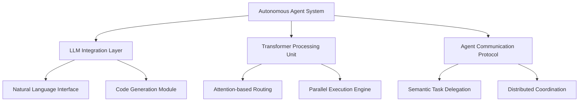
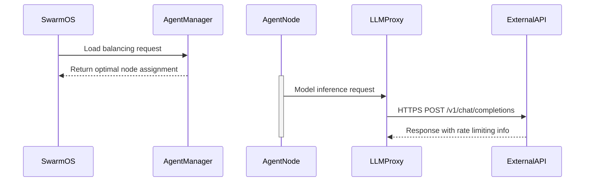

# Build Proposal: Autonomous AI Agents Integration

## Executive Summary
This proposal outlines the implementation strategy for integrating state-of-the-art large language models (LLMs) and transformer architectures into the QIAE Swarm framework. The integration aims to enhance agent intelligence through natural language processing capabilities, predictive behavior modeling, and distributed decision-making systems. This will enable more sophisticated autonomous task execution while maintaining strict adherence to Swarm OS's core architectural principles.

## Architecture Overview


## Implementation Strategy

### Phase 1: Core Architecture Development
We will implement a type-driven architecture using Rust for the agent framework, leveraging its memory safety guarantees and async/await support. The system will be designed as:

```rust
// Agent base trait definition
trait AutonomousAgent {
    fn process(&self) -> Result<()>;
    fn handle_message(&mut self, msg: Message) -> Response;
}

// LLM integration module
mod llm_integration {
    use std::sync::{Arc, Mutex};
    
    struct LanguageModel {
        model_id: String,
        tokenizer: Arc<Mutex<dyn Tokenizer>>,
        parameters: ModelParameters,
    }

    impl LanguageModel {
        fn new(model_id: &str) -> Self {
            // Initialize with specific LLM configuration
        }
        
        fn generate_response(&self, prompt: &str) -> Result<String> {
            // Implement async inference pipeline
        }
    }
}
```

### Phase 2: Performance Optimization
We will utilize WebAssembly (WASM) for computationally intensive tasks to enable seamless integration with existing Rust codebase:

```rust
// WASM module interface
#[wasm_bindgen]
pub struct OptimizedOperations {
    transform_engine: TransformEngine,
}

impl OptimizedOperations {
    #[wasm_bindgen(js_name=transformAsync)]
    pub async fn process_data(data: Vec<u8>) -> Result<Vec<u8>> {
        // Offload transformer processing to WASM
    }
}
```

### Phase 3: Observability Framework
We'll implement a comprehensive monitoring system using OpenTelemetry standards:

```python
# Python agent observability layer (example)
class AgentMetrics:
    def __init__(self):
        self.tracer = trace.Tracer()
        
    def record_processing_time(self, duration: float) -> None:
        with self.tracer.start_as_current_span("agent_process") as span:
            span.set_attribute("duration", duration)
            # Add more detailed metrics here
```

## Security Considerations

The integration requires robust safety protocols:

1. **Input Sanitization**: All LLM inputs will undergo token-level validation before processing.
2. **Result Verification**: Critical agent outputs must be cross-verified through deterministic checks.
3. **Isolation Mechanisms**: Each agent instance runs in a dedicated sandbox environment.

## Scalability Design

The architecture incorporates:



## Development Timeline

| Phase | Duration | Milestones |
|