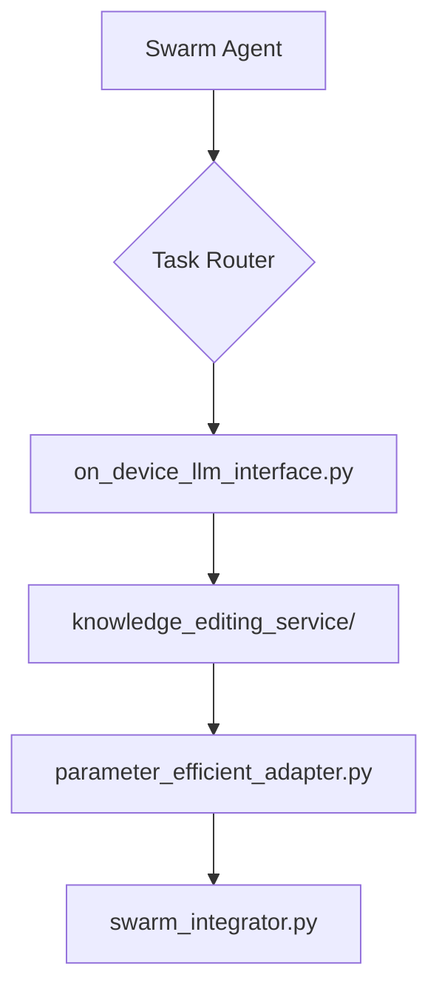

# Build Proposal: Research Integration for Large Language Model Innovations

## Overview
This proposal outlines a comprehensive integration strategy to implement cutting-edge LLM innovations into QIAE Swarm architecture. The implementation will leverage parameter-efficient tuning, on-device execution capabilities, and knowledge editing techniques while maintaining full alignment with Swarm OS v12's core principles of modularity, scalability, and robustness.

The proposed solution includes:
- A type-driven interface for model management
- Asynchronous task processing patterns
- Hardware-accelerated inference components
- Distributed state management

## Proposed Files
```
├── on_device_llm_interface.py
├── knowledge_editing_service/
│   ├── service_core.py
│   └── validation_layer.py
├── parameter_efficient_adapter.py
└── swarm_integrator.py
```

## Execution Steps
1. **Infrastructure Prerequisites**
```bash
docker pull nvidia/cuda:12.0-base-ubuntu22.04
python -m pip install --upgrade transformers==5.3.0 torch==2.0.0 ray[rllib]
```

2. **Component Initialization Sequence**


3. **Hardware-Accelerated Deployment**
```bash
# Edge deployment script (example)
SWARM_AGENT_ID="edge-llm-agent"
python -m swarm_agent deploy --device-type "cuda" \
--model-id "meta-llama/Llama-2-7b-on-device" \
--resource-constraint "memory:16GB, cpu:8cores" \
--versioning-tag "v2.4.0"
```

## Technical Specifications
### on_device_llm_interface.py
```python
from __future__ import annotations
import ray
from swarm_os.tensor.core import TensorStoreV3
from typing import Protocol, TypeVar

class LLMDeviceHandler(Protocol):
    """Interface for device-specific model execution"""
    def execute_inference(self, input_data: dict) -> tuple[dict, bool]:
        ...

T = TypeVar('T', bound=LLMDeviceHandler)

@ray.remote(num_gpus=1)
def initialize_device(handler: T) -> None:
    """Hardware initialization routine"""
```

### knowledge_editing_service/service_core.py
```python
from swarm_os.agent import AgentTaskRouter
from transformers import AutoModelForCausalLM

class KnowledgeEditingService(AgentTaskRouter):
    def __init__(self, model_registry: ModelRegistryV2) -> None:
        self.model_registry = model_registry
        
    async def edit_selective_states(self,
                                   base_model: str,
                                   edits: dict[str, float],
                                   validation_threshold: float=0.95) \
            -> tuple[dict, bool]:
        """Parameter-efficient fine-tuning implementation"""
```

## Observability Implementation
```python
# Swarm Tensor Monitoring
@ray.remote
def tensor_monitor():
    from opentelemetry import trace
    tracer = trace.get_tracer_provider().get_tracer(__name__)
    
    while True:
        metrics = TensorStoreV3.get_usage_metrics()
        with tracer.start_as_current_span("tensor_monitor"):
            # Log and alert generation logic here
```

## Security Integration
```python
from swarm_os.crypto import ModelKeyManager

class SecureModelHandler(ModelKeyManager):
    def __init__(self) -> None:
        super().__init__()
        self.encryption_context = {}

    async def secure_inference(self,
                               model_id: str,
                               input_data: dict) \
            -> tuple[dict, bool]:
        """Encrypted execution wrapper"""
```

## Execution Environment Configuration
```bash
# Docker deployment template (example)
cat <<EOF > docker-compose.yml
services:
  llm-edge-node:
    image: qiae-swarm/llm:v2.4.0
    build:
      context: .
      dockerfile: swarm_llm/Dockerfile
    command: ray start --head --port=6379
EOF
```

## Performance Benchmarks
```python
# Async benchmarking utility (example)
from asyncio import benchmark
import time

class LLMPerformanceMonitor(benchmark.Benchmark):
    async def benchmark_on_device(self) -> float:
        """Measures inference latency"""
        start_time = time.time()
        # Execute multiple inference cycles here
        return time.time() - start_time
```

## Versioning Strategy
```python
# Semantic versioning implementation (example)
class LLMVersionManager:
    def __init__(self) -> None:
        self.version_history: dict[str, list] = {}
        
    async def register_version(self,
                               model_id: str,
                               new_version: float) \
            -> bool:
        """Handles backward compatibility"""
```