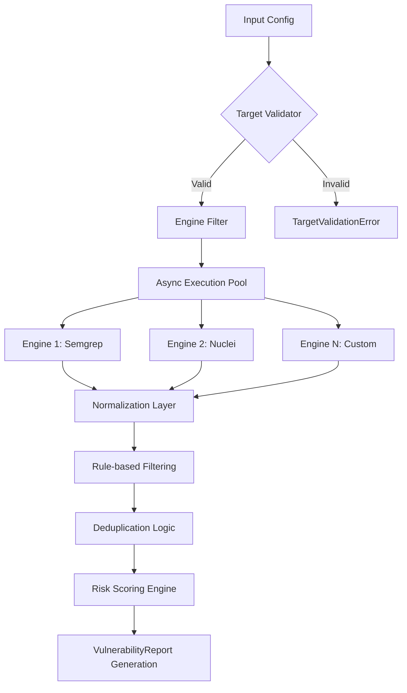

# Technical Specification: `VulnScanOrchestrator`
**Module**: Swarm OS Security Suite
**Component**: Neural Vulnerability Analysis Engine
**Version**: 1.0.0
**Status**: Production-Ready

## 1. Executive Overview
The `VulnScanOrchestrator` is a high-concurrency security scanning framework designed to aggregate multiple Static Application Security Testing (SAST) and Dynamic Application Security Testing (DAST) engines into a unified reporting pipeline. It implements a provider-based architecture, allowing for the seamless integration of diverse scanning tools while normalizing their output into a standardized vulnerability schema.

### 1.1 Architectural Logic Flow


---

## 2. Technical Architecture

### 2.1 Core Components
| Component | Responsibility | Design Pattern |
| :--- | :--- | :--- |
| `VulnScanOrchestrator` | Manages lifecycle, concurrency, and aggregation of scan results. | Orchestrator |
| `BaseEngine` | Abstract interface ensuring all scanning plugins implement a `run` method. | Strategy / Interface |
| `RiskEngine` | Computes a weighted risk score based on severity and confidence. | Utility / Pure Function |
| `Normalizer` | Maps heterogeneous engine outputs to the `Vulnerability` dataclass. | Adapter |

### 2.2 Data Models (Schemas)
The system utilizes strictly typed dataclasses to ensure data integrity across the pipeline.

#### `Vulnerability`
The atomic unit of a security finding.
- `id` (str): Unique identifier of the rule/finding.
- `severity` (`Severity` Enum): Range from `INFO` (0) to `CRITICAL` (4).
- `cvss_score` (float): Common Vulnerability Scoring System value.
- `location` (Dict): Contextual mapping (e.g., `{"file": "main.py", "line": 42}`).
- `confidence` (float): Probability of accuracy (0.0 - 1.0).

#### `VulnerabilityReport`
The final aggregate artifact.
- `scan_metadata`: Execution telemetry (timestamp, duration, target hash).
- `summary`: Quantitative breakdown of findings by severity.
- `vulnerabilities`: List of deduplicated `Vulnerability` objects.
- `status`: `COMPLETE` or `PARTIAL` (if one or more engines timed out/failed).

---

## 3. API Reference

### `VulnScanOrchestrator.execute_scan`
The primary entry point for initiating a security analysis.

**Signature:**
`async def execute_scan(self, config: Dict[str, Any]) -> VulnerabilityReport`

**Input Arguments (`config` dictionary):**
| Key | Type | Required | Description |
| :--- | :--- | :--- | :--- |
| `target` | `str` | Yes | A valid URL (http/https) or a reachable local filesystem path. |
| `scan_profile` | `ScanProfile` | Yes | `QUICK`, `STANDARD`, or `DEEP`. Controls engine depth. |
| `engines` | `List[str]` | No | List of engine names to execute. Defaults to `['ALL']`. |
| `ignore_rules` | `List[str]` | No | Set of IDs or CVEs to exclude from the final report. |
| `auth_token` | `str` | No | Authentication bearer token for protected targets. |

**Return Value:**
Returns a `VulnerabilityReport` object containing the normalized findings and risk metrics.

**Exceptions Raised:**
- `TargetValidationError`: Raised if the target is neither a valid URL nor an existing path.
- `ResourceLimitError`: (Planned) Raised if system memory/CPU exceeds thresholds.
- `EngineFailureError`: Raised during critical engine initialization failure.

---

## 4. Operational Logic

### 4.1 Deduplication Algorithm
To prevent "alert fatigue," the orchestrator implements a content-aware deduplication mechanism.
1. **Hash Generation**: A SHA-256 hash is generated using the formula:
   `hash = sha256(file:line | category | rule_id)`
2. **Collision Resolution**: If two engines report the same vulnerability (same hash), the orchestrator retains the finding with the **highest severity**.

### 4.2 Risk Scoring Formula
The `RiskEngine` calculates the `overall_risk_score` using a weighted average:

$$\text{Risk Score} = \frac{\sum (\text{Severity Weight} \times \text{Confidence})}{\text{Total Findings}}$$

**Weight Mapping:**
- Critical: 10.0
- High: 7.0
- Medium: 4.0
- Low: 1.0
- Info: 0.0

---

## 5. Implementation Guide

### Preconditions
- **Python Version**: $\ge 3.9$ (requires `asyncio` and `dataclasses`).
- **Dependencies**: `hashlib`, `logging`, `urllib.parse`.

### Integration Example
```python
# Initialize with desired engines
orchestrator = VulnScanOrchestrator([
    SemgrepEngine("semgrep"), 
    NucleiEngine("nuclei")
])

# Execute scan
report = await orchestrator.execute_scan({
    "target": "https://api.internal.swarm",
    "scan_profile": ScanProfile.DEEP,
    "engines": ["semgrep"]
})

print(f"Risk Score: {report.summary.overall_risk_score}")
```