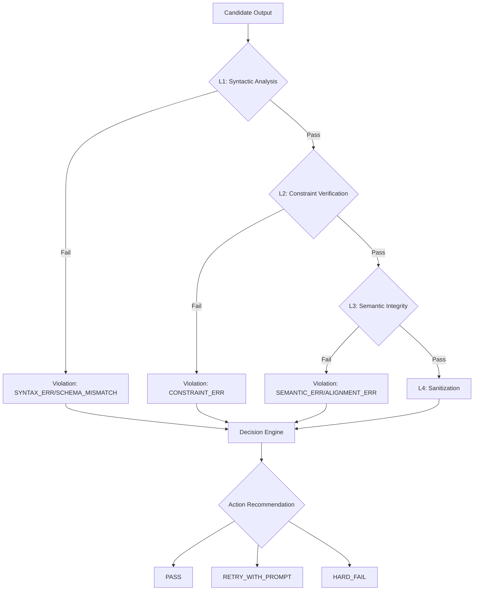

# Technical Specification: `OutputValidatorSkill`

## 1. Executive Summary
The `OutputValidatorSkill` is a high-performance, multi-stage quality assurance (QA) gate designed for the Swarm OS neural architecture. Its primary purpose is to intercept Large Language Model (LLM) outputs and subject them to a rigorous validation pipeline before they are committed to the system state or delivered to the end-user.

By implementing a tiered validation strategy—ranging from syntactic correctness to semantic alignment—the skill mitigates risks associated with hallucinations, schema drift, and structural non-compliance.

## 2. Architectural Logic Flow
The validator operates as a linear pipeline. A failure at any stage contributes to the final `confidence_score` and determines the `ActionRecommendation`.



## 3. Technical Specifications

### 3.1 Domain Models
The skill utilizes Pydantic for strict type enforcement and runtime validation.

| Model | Type | Description |
| :--- | :--- | :--- |
| `ValidationProfile` | `Enum` | Defines the validation mode: `STRICT_JSON`, `TECHNICAL_DOC`, or `CODE_PROD`. |
| `ActionRecommendation` | `Enum` | The suggested system action: `PASS`, `RETRY_WITH_PROMPT`, or `HARD_FAIL`. |
| `Violation` | `BaseModel` | Encapsulates a specific failure: `code` (ID), `message` (Human-readable), and `location` (Pointer). |
| `ValidationResult` | `BaseModel` | The final artifact containing `is_valid`, `confidence_score`, and `sanitized_output`. |

### 3.2 The Validation Pipeline (L1-L4)

#### L1: Syntactic Analysis
Validates the structural integrity of the output based on the `ValidationProfile`.
- **STRICT_JSON**: Attempts `json.loads()`. If a `schema_definition` is provided, it performs a full JSON Schema validation.
- **TECHNICAL_DOC**: Ensures the output adheres to Markdown standards (e.g., must start with an H1 header).

#### L2: Constraint Verification
Performs regex-based pattern matching against a provided list of `constraints`. This is used to ensure mandatory keywords, version numbers, or specific identifiers are present.

#### L3: Semantic Integrity
Evaluates the "truthfulness" and "intent" of the output.
- **Hallucination Detection**: Scans for known AI refusal markers (e.g., *"As an AI language model..."*).
- **Ground Truth Alignment**: If a `semantic_anchor` is provided, the skill calculates a keyword overlap ratio. A ratio $< 0.3$ triggers an `ALIGNMENT_ERR`.

#### L4: Sanitization
The final cleanup phase. It removes zero-width spaces (`\u200b`), trims whitespace, and normalizes encoding to ensure the output is production-ready.

## 4. API Reference

### `async def validate(...)`
The primary entry point for the skill.

**Arguments:**
- `candidate_output` (`str`): The raw string generated by the LLM.
- `validation_profile` (`ValidationProfile`): The profile to apply (e.g., `ValidationProfile.STRICT_JSON`).
- `schema_definition` (`Optional[Dict]`): A JSON Schema dictionary for L1 validation.
- `constraints` (`Optional[List[str]]`): A list of regex patterns that **must** be present in the output.
- `semantic_anchor` (`Optional[str]`): A reference string used to verify factual alignment.

**Returns:**
- `ValidationResult`: An object containing the validity status, a confidence score (0.0 to 1.0), and the sanitized output.

## 5. Integration Example

```python
from output_validator_skill import OutputValidatorSkill, ValidationProfile

# Initialize Skill
validator = OutputValidatorSkill()

# Define a JSON Schema for a System Config
config_schema = {
    "type": "object",
    "properties": {
        "version": {"type": "string"},
        "enabled": {"type": "boolean"}
    },
    "required": ["version", "enabled"]
}

# Candidate output from LLM
llm_output = '{"version": "1.2.0", "enabled": true}'

# Execute Validation
result = await validator.validate(
    candidate_output=llm_output,
    validation_profile=ValidationProfile.STRICT_JSON,
    schema_definition=config_schema,
    constraints=[r"1\.\d\.\d"] # Ensure version pattern is present
)

if result.action_recommendation == ActionRecommendation.PASS:
    print("Output verified. Proceeding to deployment.")
else:
    print(f"Validation failed: {result.violations}")
```

## 6. Error Handling & Recovery
The `OutputValidatorSkill` implements a defensive "Hard Fail" mechanism. If a critical system exception occurs during the pipeline (e.g., memory exhaustion or unexpected type errors), the skill catches the exception and returns a `ValidationResult` with `ActionRecommendation.HARD_FAIL` and a `SYSTEM_CRITICAL_ERR` code, preventing corrupted data from propagating through the Swarm OS.