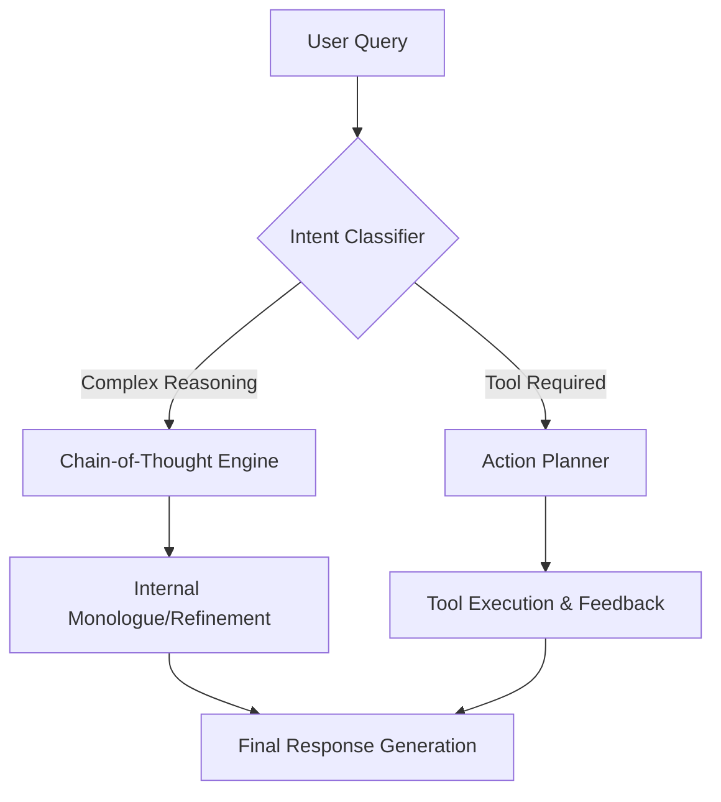

# Implementation Plan: Large Language Model Innovations Integration

## 1. Executive Summary
This document outlines the strategic roadmap for integrating state-of-the-art LLM architectural improvements and inference optimizations into the Swarm OS ecosystem. The goal is to transition from standard transformer-based processing to a high-efficiency, modular architecture capable of supporting autonomous agentic workflows with reduced latency and increased reasoning depth.

## 2. Core Architectural Pillars

### A. Hybrid Mixture of Experts (MoE) Integration
To optimize computational efficiency while maintaining model capacity, Swarm OS will transition toward a sparse activation model.
*   **Mechanism**: Implement a MoE layer where only a subset of "experts" (specialized sub-networks) are activated for any given token.
*   **Benefit**: Reduces FLOPs per inference while allowing the system to maintain a massive total parameter count for diverse knowledge domains.
*   **Implementation**: Integrate `Gate` mechanisms to route queries based on semantic intent (e.g., coding, logic, creative writing).

### B. Advanced Attention Mechanisms
Replace standard $O(n^2)$ attention with optimized variants:
*   **FlashAttention-2**: Implement for faster memory-efficient attention calculation.
*   **Grouped-Query Attention (GQA)**: Balance the trade-off between Multi-Head Attention (MHA) and Multi-Query Attention (MQA).
*   **Sliding Window Attention**: For long-context processing to maintain local coherence without quadratic cost.

### C. Inference Optimization & Quantization
To ensure production-grade performance on heterogeneous hardware:
*   **Quantization Strategy**: Implement 4-bit/8-bit quantization (bitsandbytes, AWQ) for standard inference nodes.
*   **Speculative Decoding**: Utilize a smaller "draft" model to predict tokens, validated by the primary large model to reduce per-token latency.
*   **KV Cache Management**: Implement PagedAttention to optimize memory allocation for long-context windows.

## 3. Agentic Framework Enhancements
Integrating LLM innovations into autonomous agent behavior:

*   **Chain-of-Thought (CoT) Integration**: Mandatory internal reasoning steps for high-complexity tasks.
*   **ReAct Pattern**: Implementation of a "Reason + Act" loop where the agent generates a thought, performs an action, and observes the result before proceeding.
*   **Tool-Use Synthesis**: A standardized schema for LLMs to interact with external APIs (JSON mode enforcement).

## 4. Implementation Roadmap

### Phase I: Foundation (Weeks 1-4)
- [ ] **Infrastructure**: Deploy FlashAttention kernels and integrate GQA into the base model weights.
- [ ] **Quantization Pipeline**: Establish a standard pipeline for converting models to 4-bit/8-bit formats for edge deployment.
- [ ] **Telemetry**: Implement hooks for monitoring "Token Per Second" (TPS) and "Time to First Token" (TTFT).

### Phase II: Optimization (Weeks 5-8)
- [ ] **MoE Routing**: Develop the gating logic for specialized expert routing.
- [ ] **Speculative Decoding**: Deploy a secondary, low-parameter model for draft generation in high-concurrency environments.
- [ ] **Context Management**: Implement PagedAttention to support 128k+ token windows efficiently.

### Phase III: Autonomy & Scaling (Weeks 9-12)
- [ ] **Agentic Loop**: Integrate the ReAct and CoT frameworks into the Swarm OS agent controller.
- [ ] **Multi-Agent Orchestration**: Implement a "Manager" node to delegate tasks among specialized agents based on MoE-derived capabilities.
- [ ] **Feedback Loops**: Implement RLHF/DPO fine-tuning loops for specific task success metrics.

## 5. Technical Specifications & Requirements
| Component | Technology / Standard | Target Metric |
| :--- | :--- | :--- |
| **Base Architecture** | Transformer (MoE Variant) | <20% overhead vs MHA |
| **Quantization** | AWQ / GPTQ | >85% weight reduction |
| **Inference Engine** | vLLM / TensorRT-LLM | 3x throughput increase |
| **Context Window** | Sliding Window + PagedAttention | 128k Tokens |
| **Agent Logic** | ReAct / Chain-of-Thought | >90% task success rate |

## 6. Risk Mitigation
*   **Model Drift**: Regular evaluation against a "Golden Set" of benchmarks to ensure quantization doesn't degrade reasoning.
*   **Latency Spikes**: Implement request queuing and load balancing for MoE expert routing.
*   **Hallucination Control**: Use RAG (Retrieval-Augmented Generation) as a primary guardrail for factual queries.
]