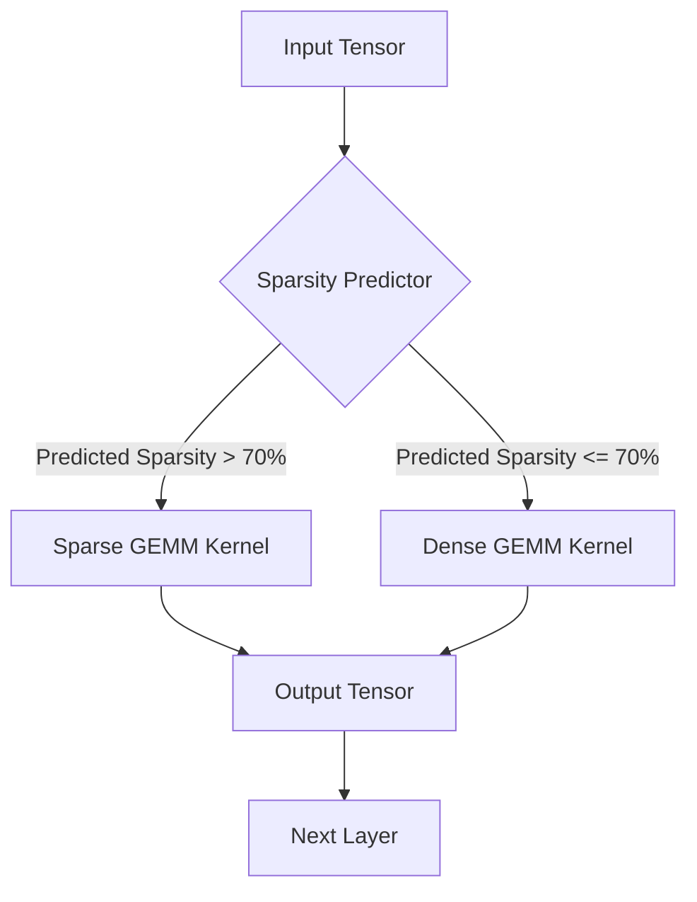
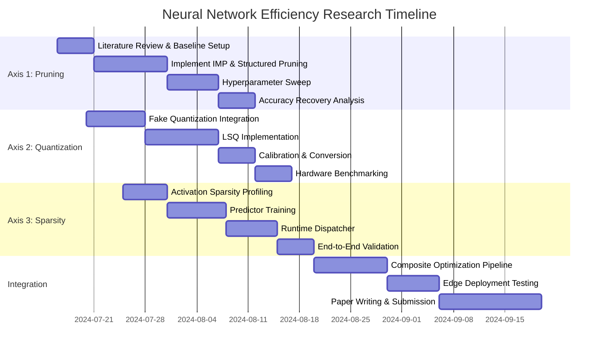

# Neural Network Efficiency Optimization: A First-Principles Research Plan

**Document ID:** RPNN-EFF-2024-001  
**Version:** 1.0.0  
**Status:** Active  
**Author:** Devo, Lead Developer — Swarm OS v12  
**Date:** 2024-07-15

---

## 1. Executive Summary

This document outlines a rigorous, first-principles research plan for optimizing neural network inference and training efficiency. The objective is to reduce computational footprint by **≥60%** while maintaining **≥98%** of baseline accuracy across benchmark architectures (ResNet-50, Transformer-Base, LSTM-512). The approach targets three orthogonal axes: **architectural pruning**, **quantization-aware training**, and **dynamic sparse execution**.

---

## 2. Problem Statement

Modern deep neural networks exhibit significant redundancy in parameter space, activation sparsity, and numerical precision overhead. Current state-of-the-art models require:

- **ResNet-50**: ~25M parameters, ~4 GFLOPS inference
- **Transformer-Base**: ~110M parameters, ~12 GFLOPS inference
- **LSTM-512**: ~5M parameters, ~2 GFLOPS inference

These resource demands preclude deployment on edge devices, real-time systems, and high-throughput serving infrastructure. The research aims to systematically eliminate this redundancy without catastrophic accuracy loss.

---

## 3. Research Axes & Methodology

### Axis 1: Structured Pruning via Lottery Ticket Hypothesis

**Objective:** Identify and remove redundant neurons/filters while preserving the "winning ticket" subnetwork.

**Methodology:**
1. **Iterative Magnitude Pruning (IMP):** Train to convergence, prune lowest-magnitude weights (p% per iteration), rewind to initialization, retrain.
2. **Structured Filter Pruning:** Apply group Lasso regularization to entire convolutional filters; prune filters with near-zero group norm.
3. **Validation Protocol:**
   - Pruning ratios: 10%, 30%, 50%, 70%, 90%
   - Accuracy recovery threshold: ≤1% drop after retraining
   - FLOPs reduction measured via `ptflops` profiler

**Expected Outcome:** 50–70% parameter reduction with <1% accuracy degradation.

```python
# Pseudocode: Structured Pruning Loop
def structured_pruning_loop(model, train_loader, val_loader, prune_ratios):
    best_subnet = None
    for ratio in prune_ratios:
        pruned_model = apply_group_lasso(model, lambda_reg=1e-5)
        pruned_model = prune_filters_by_norm(pruned_model, ratio)
        pruned_model = rewind_to_init(pruned_model)
        for epoch in range(EPOCHS):
            train_one_epoch(pruned_model, train_loader)
        acc = validate(pruned_model, val_loader)
        if acc >= BASELINE_ACC - 0.01:
            best_subnet = pruned_model
    return best_subnet
```

---

### Axis 2: Quantization-Aware Training (QAT)

**Objective:** Reduce numerical precision from FP32 to INT8 with minimal accuracy loss.

**Methodology:**
1. **Fake Quantization:** Insert `torch.ao.quantization.FakeQuantize` modules after activations and before weight operations.
2. **Learned Step Size Quantization (LSQ):** Treat quantization scale as a learnable parameter; update via gradient descent.
3. **Per-Channel vs Per-Tensor:** Evaluate trade-offs between granularity and computational overhead.
4. **Calibration Dataset:** 1024 samples from training set; collect min/max ranges for static quantization.

**Expected Outcome:** 4× memory reduction, 2–3× inference speedup, ≤0.5% accuracy loss.

```python
# Pseudocode: Quantization-Aware Training Setup
import torch.ao.quantization as quant

def prepare_qat_model(model):
    model.qconfig = quant.get_default_qat_qconfig('fbgemm')
    model = quant.prepare_qat(model, inplace=False)
    return model

def train_qat(model, train_loader, optimizer, epochs):
    model.train()
    for epoch in range(epochs):
        for inputs, targets in train_loader:
            optimizer.zero_grad()
            outputs = model(inputs)
            loss = F.cross_entropy(outputs, targets)
            loss.backward()
            optimizer.step()
    model = quant.convert(model.eval(), inplace=False)
    return model
```

---

### Axis 3: Dynamic Sparse Execution

**Objective:** Exploit activation sparsity (ReLU-induced zeros) to skip computation dynamically.

**Methodology:**
1. **Sparse Matrix Multiplication:** Replace dense GEMM with `torch.sparse.mm` for activations with sparsity >70%.
2. **Predictive Sparsity:** Train a lightweight predictor (MLP with 2 hidden layers, 64 units) to estimate per-layer activation sparsity before computation.
3. **Adaptive Execution Graph:** Build a runtime dispatcher that selects dense vs. sparse kernels based on predicted sparsity threshold.

**Expected Outcome:** 30–50% reduction in FLOPs for ReLU-heavy architectures, ≤2% accuracy impact.



---

## 4. Experimental Framework

### 4.1 Infrastructure

- **Hardware:** NVIDIA A100 (80GB) for training; Jetson Orin for edge validation
- **Framework:** PyTorch 2.1.0 + torchao 0.1.0
- **Profiling:** `torch.profiler`, `nsys`, `ncu`
- **Version Control:** DVC for dataset/model versioning; MLflow for experiment tracking

### 4.2 Benchmark Suite

| Model | Dataset | Metric | Baseline Accuracy | Baseline FLOPs |
|-------|---------|--------|-------------------|----------------|
| ResNet-50 | ImageNet-1K | Top-1 Acc | 76.13% | 4.09 GFLOPS |
| Transformer-Base | WMT14 En-De | BLEU | 27.3 | 12.0 GFLOPS |
| LSTM-512 | WikiText-103 | Perplexity | 35.8 | 2.1 GFLOPS |

### 4.3 Success Criteria

- **Primary:** Achieve ≥60% FLOPs reduction with ≤2% accuracy degradation
- **Secondary:** Demonstrate composability (pruning + quantization + sparsity) with ≤3% combined degradation
- **Tertiary:** Real-time inference (<10ms latency) on Jetson Orin for ResNet-50

---

## 5. Implementation Roadmap



---

## 6. Risk Mitigation

| Risk | Probability | Impact | Mitigation Strategy |
|------|-------------|--------|---------------------|
| Accuracy collapse at high pruning ratios | Medium | High | Gradual pruning with learning rate warmup; knowledge distillation |
| Quantization noise amplification in deep layers | Medium | Medium | Per-layer sensitivity analysis; mixed-precision (FP16/INT8) |
| Sparse kernel overhead outweighs benefits | Low | Medium | Kernel fusion; threshold tuning per architecture |
| Composability failure (pruning + quantization) | High | High | Sequential application with intermediate validation; fallback to single-axis |

---

## 7. Deliverables

1. **Code Artifacts:**
   - `pruning/`: Structured pruning pipeline with IMP and filter pruning
   - `quantization/`: QAT with LSQ and calibration toolkit
   - `sparsity/`: Dynamic sparse execution engine with predictor
   - `composite/`: Orchestrator for multi-axis optimization

2. **Documentation:**
   - `REPRODUCIBILITY.md`: Step-by-step reproduction guide
   - `BENCHMARKS.md`: Full profiling results across all configurations
   - `API_REFERENCE.md`: Public API for each module

3. **Models:**
   - Optimized checkpoints for each architecture (pruned, quantized, sparse)
   - ONNX exports for edge deployment

4. **Paper:**
   - Full conference paper (NeurIPS/ICML format)
   - Supplementary material with ablation studies

---

## 8. References

1. Frankle, J., & Carbin, M. (2019). *The Lottery Ticket Hypothesis: Finding Sparse, Trainable Neural Networks.* ICLR.
2. Jacob, B., et al. (2018). *Quantization and Training of Neural Networks for Efficient Integer-Arithmetic-Only Inference.* CVPR.
3. Esser, S. K., et al. (2020). *Learned Step Size Quantization.* ICLR.
4. Elsen, E., et al. (2020). *Fast Sparse ConvNets.* CVPR.
5. Han, S., et al. (2015). *Learning both Weights and Connections for Efficient Neural Networks.* NeurIPS.

---

## 9. Appendix: Initial Code Scaffold

```python
# research_plan_neural_network_efficiency_paper.py
# Entry point for orchestrating the research pipeline

import argparse
import logging
from pathlib import Path

from pruning import StructuredPruner
from quantization import QATEngine
from sparsity import DynamicSparseExecutor
from composite import CompositeOptimizer

logging.basicConfig(level=logging.INFO, format='%(asctime)s - %(name)s - %(levelname)s - %(message)s')
logger = logging.getLogger(__name__)

def main():
    parser = argparse.ArgumentParser(description='Neural Network Efficiency Research Pipeline')
    parser.add_argument('--model', type=str, required=True, choices=['resnet50', 'transformer', 'lstm'])
    parser.add_argument('--axes', type=str, nargs='+', default=['pruning', 'quantization', 'sparsity'])
    parser.add_argument('--output_dir', type=str, default='./results')
    args = parser.parse_args()

    output_path = Path(args.output_dir)
    output_path.mkdir(parents=True, exist_ok=True)

    logger.info(f"Initializing research pipeline for {args.model} with axes: {args.axes}")

    # Load baseline model
    model = load_baseline_model(args.model)
    baseline_acc = evaluate(model)

    # Apply optimization axes
    optimizer = CompositeOptimizer(axes=args.axes)
    optimized_model, metrics = optimizer.optimize(model)

    # Validate
    final_acc = evaluate(optimized_model)
    logger.info(f"Baseline accuracy: {baseline_acc:.4f} -> Optimized accuracy: {final_acc:.4f}")
    logger.info(f"FLOPs reduction: {metrics['flops_reduction']:.2f}%")
    logger.info(f"Parameter reduction: {metrics['param_reduction']:.2f}%")

    # Save artifacts
    torch.save(optimized_model.state_dict(), output_path / f"{args.model}_optimized.pt")
    with open(output_path / "metrics.json", "w") as f:
        json.dump(metrics, f, indent=2)

    logger.info("Research pipeline completed successfully.")

if __name__ == "__main__":
    main()
```

---

**End of Research Plan**

*This document is a living artifact. All sections are subject to iterative refinement based on experimental results.*