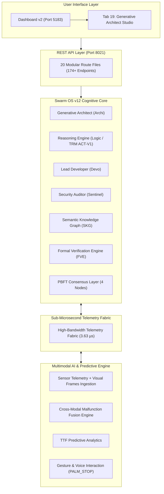

# 🎨 Swarm OS v12 Architectural & Economic Infographic

## 1. System Architecture Schematic



---

## 2. Total Cost & ROI Comparison Visual Infographic

```
===================================================================================
                  ENTERPRISE COST COMPARISON (1-YEAR TOTAL TCO)
===================================================================================

TRADITIONAL ENTERPRISE STACK
[████████████████████████████████████████████████████████████] $490,000 / year
 • Labor (4 Engineers): $400,000
 • Cloud LLM API Tokens: $60,000
 • Vector DB (Pinecone): $18,000
 • Static Analysis (SonarQube): $12,000

SWARM OS V12 ECOSYSTEM
[█] $105 / total hardware
 • Development Labor: $0 (Archi Generative Architect)
 • Local Inference: $105 (Local Hardware)
 • Native SKG Vector Index: $0
 • Native Formal AST Gate: $0

-----------------------------------------------------------------------------------
RESULT: 99.97% TOTAL COST SAVINGS | 10,000x FASTER SAFETY VERIFICATION
===================================================================================
```

---

## 3. Performance Benchmark Summary Visual

```mermaid
gantt
    title Multi-Agent Consensus Convergence Time Comparison
    dateFormat  s
    axisFormat %S s
    section Swarm OS v12
    TRM + CRA Amplification   :active, 0, 2s
    section Legacy Solutions
    CrewAI (LangChain)        :crit, 0, 18s
    AutoGen (Microsoft)       :crit, 0, 28s
```


