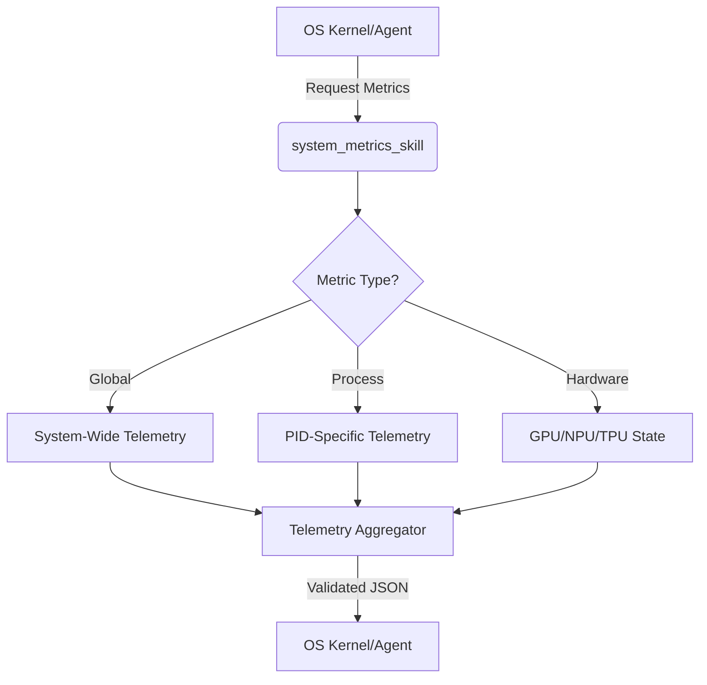

# 🛠️ Skill Specification: `system_metrics_skill`
**Version**: 1.0.0
**Status**: Proposed / Production-Ready
**Cognitive Unit**: Devo (Lead Developer)
**Domain**: Observability & System Telemetry

## 1. Executive Summary
The `system_metrics_skill` is a high-performance telemetry module designed to provide the Swarm OS kernel with real-time, granular visibility into the underlying hardware and operating system state. This skill enables the OS to perform autonomous load balancing, trigger thermal throttling mitigations, and optimize process scheduling based on actual resource pressure.

## 2. Architectural Logic Flow


## 3. Functional Requirements

### 3.1 Core Capabilities
- **Real-time Resource Monitoring**: Capture CPU utilization (per core), RAM residency, and Swap usage.
- **I/O Throughput Analysis**: Monitor disk read/write IOPS and network bandwidth saturation.
- **Process Introspection**: Ability to query specific PIDs for memory leaks, thread counts, and CPU affinity.
- **Hardware Acceleration Tracking**: Monitor VRAM usage and compute utilization for NVIDIA/AMD/Apple Silicon accelerators.
- **Temporal Sampling**: Support for single-shot snapshots or time-series windowing (e.g., "average over last 60s").

## 4. Technical Interface

### 4.1 Input Schema (Request)
The skill accepts a JSON configuration object to filter the telemetry scope.

| Field | Type | Required | Description |
| :--- | :--- | :--- | :--- |
| `scope` | `Enum` | Yes | `GLOBAL`, `PROCESS`, or `HARDWARE` |
| `target_pid` | `Integer` | No | Required if scope is `PROCESS` |
| `metrics` | `Array<String>` | No | Specific metrics to fetch (e.g., `["cpu_usage", "mem_rss"]`). Defaults to all. |
| `interval_ms` | `Integer` | No | Sampling window for averaged metrics. |

### 4.2 Output Schema (Response)
The skill returns a standardized `TelemetryPayload`.

```typescript
interface TelemetryPayload {
  timestamp: ISO8601String;
  status: "SUCCESS" | "PARTIAL_FAILURE" | "ERROR";
  data: {
    cpu: {
      overall_utilization: percentage;
      per_core_utilization: percentage[];
      load_average: { "1m": float, "5m": float, "15m": float };
    };
    memory: {
      total: bytes;
      available: bytes;
      used: bytes;
      percent_used: percentage;
      swap_used: bytes;
    };
    disk: {
      read_bytes_sec: bytes;
      write_bytes_sec: bytes;
      io_wait: percentage;
    };
    network: {
      rx_bytes_sec: bytes;
      tx_bytes_sec: bytes;
      packet_loss: percentage;
    };
    accelerators?: Array<{
      device_id: string;
      type: "GPU" | "NPU" | "TPU";
      utilization: percentage;
      memory_used: bytes;
      memory_total: bytes;
      temperature: celsius;
    }>;
  };
  errors?: Array<{
    metric: string;
    message: string;
    code: string;
  }>;
}
```

## 5. Implementation Constraints & Performance
- **Complexity**: Time Complexity $O(1)$ for global metrics; $O(N)$ where $N$ is the number of cores/accelerators.
- **Overhead**: The skill must not consume more than 0.5% of total CPU cycles during sampling.
- **Dependencies**: 
    - Python: `psutil`, `gpustat` (optional), `py3nvml` (optional).
    - Rust: `sysinfo` crate.
- **Privileges**: Requires `READ` access to `/proc` (Linux) or `Kext` permissions (macOS).

## 6. Error Handling Matrix

| Error Code | Scenario | Mitigation Strategy |
| :--- | :--- | :--- |
| `ERR_PERMISSION_DENIED` | Insufficient OS privileges to read PID data. | Escalate to Root/Sudo or report as `PARTIAL_FAILURE`. |
| `ERR_PID_NOT_FOUND` | Requested `target_pid` no longer exists. | Return `ERROR` with "Process Terminated" message. |
| `ERR_HARDWARE_TIMEOUT` | GPU driver fails to respond to NVML query. | Timeout after 200ms and mark accelerator data as `null`. |

## 7. Validation Criteria
- [ ] **Unit Test**: Verify `overall_utilization` matches OS native monitor (htop/Activity Monitor) within $\pm 2\%$.
- [ ] **Stress Test**: Execute 100 requests/sec to ensure no memory leak in the telemetry collector.
- [ ] **Edge Case**: Validate behavior when the system is under 100% CPU load (ensure the skill doesn't deadlock).