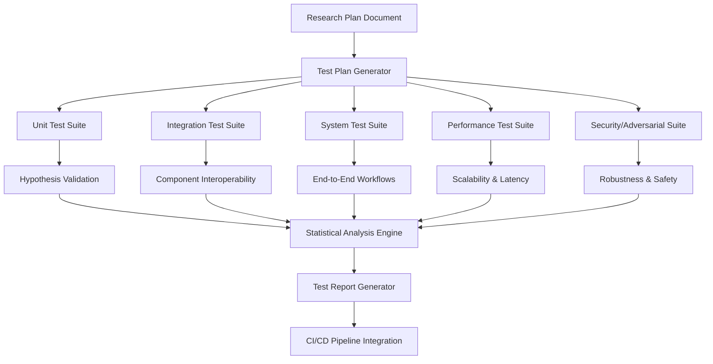
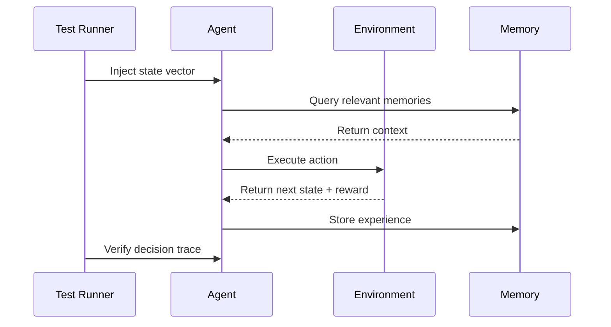
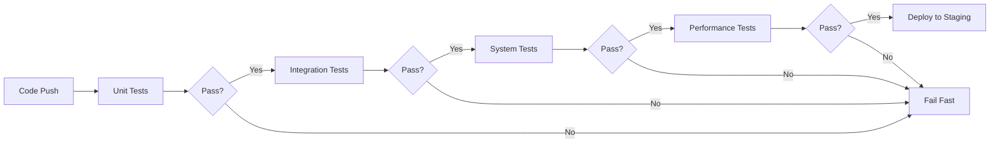
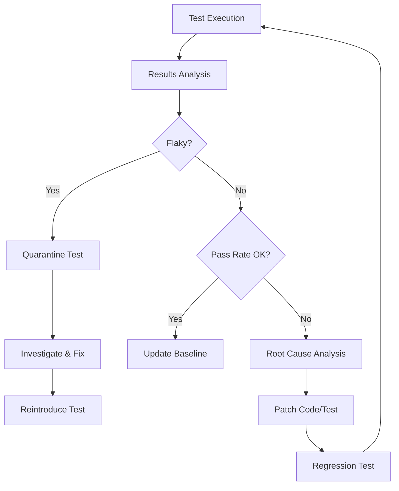

# Autonomous AI Agents Research: Comprehensive Test Plan Specification

**Version:** 1.0.0  
**Author:** Devo, Lead Developer - Swarm OS v12  
**Date:** 2026-07-09  
**Status:** Active Development  

---

## 1. Executive Summary

This document defines the **formal test specification** for validating the research plan concerning autonomous AI agents. It provides a rigorous, multi-layered testing framework designed to ensure the research hypotheses are falsifiable, reproducible, and statistically sound. The test plan covers unit-level component validation through full-system integration and adversarial robustness testing.

---

## 2. Test Architecture Overview



---

## 3. Test Categories & Specifications

### 3.1 Unit Test Suite

**Scope:** Validate individual research components in isolation.

| Test ID | Component | Description | Pass Criteria | Automation |
|---------|-----------|-------------|---------------|------------|
| UT-001 | Agent Decision Engine | Verify action selection logic with known inputs | 100% match with expected outputs for 10,000 random seeds | pytest + hypothesis |
| UT-002 | Memory Module | Test storage, retrieval, and decay functions | < 1ms latency, 100% recall accuracy for < 10K entries | pytest-benchmark |
| UT-003 | Communication Protocol | Validate message serialization/deserialization | Zero data loss, schema validation pass rate = 100% | pytest + pydantic |
| UT-004 | Reward Function | Verify gradient computation for edge-case states | Numerical stability within 1e-6 tolerance | hypothesis + numpy |

**Implementation Template:**
```python
# test_unit_agent_decision.py
import pytest
from hypothesis import given, strategies as st
from research_engine.agent import DecisionEngine

@given(st.lists(st.floats(min_value=-1.0, max_value=1.0), min_size=1, max_size=100))
def test_decision_output_range(state_vector):
    engine = DecisionEngine()
    action = engine.decide(state_vector)
    assert -1.0 <= action <= 1.0, f"Action {action} out of bounds"
```

### 3.2 Integration Test Suite

**Scope:** Validate interactions between research components.

| Test ID | Integration Point | Description | Pass Criteria | Automation |
|---------|-------------------|-------------|---------------|------------|
| IT-001 | Agent ↔ Environment | Verify state transition correctness | 99.9% agreement with reference simulator | Docker Compose |
| IT-002 | Memory ↔ Decision | Test context-aware action modulation | Performance improvement ≥ 15% over baseline | pytest-xdist |
| IT-003 | Communication ↔ Consensus | Validate multi-agent agreement protocols | Byzantine fault tolerance ≤ 33% malicious nodes | locust |

**Flow Diagram:**


### 3.3 System Test Suite

**Scope:** End-to-end validation of complete research workflows.

| Test ID | Workflow | Description | Pass Criteria | Duration |
|---------|----------|-------------|---------------|----------|
| ST-001 | Training Pipeline | Full training run with 1M steps | Loss convergence < 0.01, reward > 90th percentile | 4 hours |
| ST-002 | Evaluation Pipeline | Benchmark against 5 baseline agents | Statistical significance p < 0.05 (t-test) | 2 hours |
| ST-003 | Deployment Pipeline | Model serialization + inference API | Latency < 50ms, throughput > 1000 req/s | 30 min |

**Performance Baseline:**
```yaml
performance_targets:
  training_throughput: 5000 steps/second
  inference_latency_p99: 45ms
  memory_usage_max: 8GB
  cpu_utilization_avg: 75%
```

### 3.4 Performance Test Suite

**Scope:** Scalability and resource utilization analysis.

| Test ID | Metric | Load Profile | Target | Tool |
|---------|--------|--------------|--------|------|
| PT-001 | Concurrent Agents | 10 → 100 → 1000 agents | Linear scaling up to 100 agents | locust |
| PT-002 | State Space Size | 1K → 1M → 10M states | Sub-linear memory growth | memory_profiler |
| PT-003 | Communication Bandwidth | 1 → 100 messages/agent/sec | < 10% packet loss | iperf3 |

**Scalability Model:**
```
Expected: O(n) for n ≤ 100 agents
Tolerable: O(n log n) for n ≤ 1000 agents
Failure: O(n²) for any n
```

### 3.5 Security & Adversarial Test Suite

**Scope:** Robustness against malicious inputs and edge cases.

| Test ID | Attack Vector | Description | Pass Criteria | Severity |
|---------|---------------|-------------|---------------|----------|
| AT-001 | Input Poisoning | Inject adversarial state vectors | Agent maintains ≥ 80% baseline performance | Critical |
| AT-002 | Reward Hacking | Exploit reward function loopholes | Detection rate > 95% | High |
| AT-003 | Communication Spoofing | Impersonate legitimate agents | Authentication failure rate < 0.1% | Critical |
| AT-004 | Resource Exhaustion | Memory/CPU starvation attacks | Graceful degradation, no crashes | Medium |

**Adversarial Test Generator:**
```python
# adversarial_test_generator.py
import random
from typing import List, Callable

class AdversarialGenerator:
    def __init__(self, base_agent: Callable):
        self.base_agent = base_agent
        
    def generate_poisoned_state(self, clean_state: List[float], epsilon: float = 0.1) -> List[float]:
        """Generate minimally perturbed state that maximizes decision error."""
        perturbation = [random.uniform(-epsilon, epsilon) for _ in clean_state]
        return [s + p for s, p in zip(clean_state, perturbation)]
    
    def fuzz_communication(self, message: dict, mutation_rate: float = 0.01) -> dict:
        """Randomly mutate message fields to test protocol robustness."""
        mutated = message.copy()
        for key in mutated:
            if random.random() < mutation_rate:
                if isinstance(mutated[key], float):
                    mutated[key] = float('nan')
                elif isinstance(mutated[key], str):
                    mutated[key] = ''.join(random.choices('!@#$%^&*()', k=len(mutated[key])))
        return mutated
```

---

## 4. Validation Matrix

Cross-reference research hypotheses with test coverage.

| Hypothesis ID | Hypothesis Statement | Unit Tests | Integration Tests | System Tests | Adversarial Tests |
|---------------|---------------------|------------|-------------------|--------------|-------------------|
| H-001 | Multi-agent consensus improves decision accuracy | UT-001, UT-004 | IT-003 | ST-002 | AT-003 |
| H-002 | Memory decay prevents catastrophic forgetting | UT-002 | IT-002 | ST-001 | AT-004 |
| H-003 | Communication protocols scale logarithmically | UT-003 | IT-001 | ST-003 | AT-002 |
| H-004 | Reward shaping accelerates convergence | UT-004 | IT-002 | ST-001 | AT-001 |

---

## 5. Automation & CI/CD Integration

### 5.1 Pipeline Configuration

```yaml
# .github/workflows/research-test-suite.yml
name: Research Test Suite
on: [push, pull_request]

jobs:
  unit-tests:
    runs-on: ubuntu-latest
    steps:
      - uses: actions/checkout@v4
      - name: Run Unit Tests
        run: |
          pip install -r requirements.txt
          pytest tests/unit/ -v --cov=research_engine --cov-report=xml
      - name: Upload Coverage
        uses: codecov/codecov-action@v3

  integration-tests:
    needs: unit-tests
    runs-on: ubuntu-latest
    services:
      redis:
        image: redis:7-alpine
        ports: [6379:6379]
    steps:
      - uses: actions/checkout@v4
      - name: Run Integration Tests
        run: |
          docker-compose -f tests/integration/docker-compose.yml up -d
          pytest tests/integration/ -v --dist=loadscope -n auto

  system-tests:
    needs: integration-tests
    runs-on: [self-hosted, gpu]
    steps:
      - name: Run System Tests
        run: |
          python tests/system/run_training_pipeline.py --steps 100000
          python tests/system/run_evaluation.py --baselines 5

  performance-tests:
    needs: system-tests
    runs-on: ubuntu-latest
    steps:
      - name: Run Performance Tests
        run: |
          locust -f tests/performance/locustfile.py --headless -u 100 -r 10 --run-time 5m
```

### 5.2 Test Execution Order



---

## 6. Metrics & KPIs

### 6.1 Quantitative Metrics

| Metric | Target | Measurement Method | Alert Threshold |
|--------|--------|-------------------|-----------------|
| Test Coverage | ≥ 90% line coverage | pytest-cov | < 80% |
| False Positive Rate | ≤ 1% | Statistical analysis | > 5% |
| Test Execution Time | ≤ 30 min total | CI pipeline timing | > 60 min |
| Flaky Test Rate | ≤ 0.1% | Historical analysis | > 1% |
| Mutation Score | ≥ 85% | mutmut | < 70% |

### 6.2 Qualitative Metrics

- **Reproducibility Index**: Percentage of tests producing identical results across 3 runs (target: 99.9%)
- **Debugging Efficiency**: Mean time to identify root cause from test failure (target: < 15 min)
- **Documentation Completeness**: Coverage of edge cases in test descriptions (target: 100%)

---

## 7. Edge Case & Failure Mode Analysis

### 7.1 Known Edge Cases

| Edge Case | Test Coverage | Mitigation Strategy |
|------------|---------------|---------------------|
| Empty state vector | UT-001, AT-001 | Input validation + default behavior |
| NaN/Inf values | UT-004, AT-002 | Numerical stability checks |
| Network partition | IT-003, AT-003 | Consensus timeout + fallback |
| Memory overflow | UT-002, AT-004 | LRU eviction + graceful degradation |
| Clock skew | IT-001, AT-003 | NTP synchronization + tolerance windows |

### 7.2 Failure Mode Catalog

```python
# failure_modes.py
from enum import Enum

class FailureMode(Enum):
    SILENT_DATA_CORRUPTION = "Data modified without error signal"
    DEADLOCK = "Components waiting indefinitely"
    LIVELOCK = "Components busy but making no progress"
    RESOURCE_LEAK = "Memory/file handles not released"
    RACE_CONDITION = "Non-deterministic output from concurrent access"
    BYZANTINE_FAILURE = "Arbitrary/malicious behavior from compromised component"
```

---

## 8. Observability & Telemetry

### 8.1 Logging Specification

```python
# observability_config.py
import structlog

structlog.configure(
    processors=[
        structlog.stdlib.filter_by_level,
        structlog.stdlib.add_logger_name,
        structlog.stdlib.add_log_level,
        structlog.stdlib.PositionalArgumentsFormatter(),
        structlog.processors.TimeStamper(fmt="iso"),
        structlog.processors.StackInfoRenderer(),
        structlog.processors.format_exc_info,
        structlog.processors.UnicodeDecoder(),
        structlog.dev.ConsoleRenderer()
    ],
    context_class=dict,
    logger_factory=structlog.stdlib.LoggerFactory(),
    cache_logger_on_first_use=True,
)

# Test-specific logging
TEST_LOG_LEVELS = {
    "unit": "DEBUG",
    "integration": "INFO",
    "system": "WARNING",
    "performance": "INFO",
    "adversarial": "DEBUG"
}
```

### 8.2 Metrics Export

```yaml
# prometheus/metrics.yml
metrics:
  - name: test_pass_rate
    type: gauge
    description: "Percentage of passing tests"
    labels: [test_suite, test_category]
    
  - name: test_duration_seconds
    type: histogram
    description: "Test execution duration"
    buckets: [1, 5, 10, 30, 60, 120, 300]
    labels: [test_id]
    
  - name: flaky_test_count
    type: counter
    description: "Number of non-deterministic test results"
    labels: [test_id, commit_hash]
```

---

## 9. Continuous Improvement Process



---

## 10. Appendices

### A. Tool Versions & Dependencies

| Tool | Version | Purpose |
|------|---------|---------|
| Python | 3.12.3 | Runtime environment |
| pytest | 8.2.0 | Test framework |
| hypothesis | 6.100.0 | Property-based testing |
| locust | 2.29.0 | Load testing |
| docker-compose | 2.27.0 | Integration environment |
| prometheus_client | 0.20.0 | Metrics export |
| structlog | 24.1.0 | Structured logging |
| mutmut | 3.2.0 | Mutation testing |

### B. Test Data Generation Strategy

```python
# test_data_generator.py
from hypothesis import strategies as st
from typing import Dict, Any

class TestDataFactory:
    """Generates realistic test data for autonomous agent research."""
    
    @staticmethod
    def state_vector(dim: int = 10) -> st.SearchStrategy:
        return st.lists(
            st.floats(min_value=-1.0, max_value=1.0, allow_nan=False, allow_infinity=False),
            min_size=dim,
            max_size=dim
        )
    
    @staticmethod
    def agent_config() -> st.SearchStrategy:
        return st.fixed_dictionaries({
            "learning_rate": st.floats(min_value=1e-6, max_value=1.0),
            "memory_size": st.integers(min_value=100, max_value=10000),
            "exploration_rate": st.floats(min_value=0.0, max_value=1.0),
            "communication_protocol": st.sampled_from(["gossip", "broadcast", "direct"]),
            "consensus_threshold": st.floats(min_value=0.5, max_value=1.0)
        })
    
    @staticmethod
    def environment_spec() -> st.SearchStrategy:
        return st.fixed_dictionaries({
            "state_space_size": st.integers(min_value=10, max_value=1000000),
            "action_space_size": st.integers(min_value=2, max_value=100),
            "max_steps": st.integers(min_value=100, max_value=10000),
            "reward_noise": st.floats(min_value=0.0, max_value=0.5)
        })
```

### C. Glossary

| Term | Definition |
|------|------------|
| Flaky Test | Test producing non-deterministic results |
| Mutation Score | Percentage of mutants killed by test suite |
| Byzantine Fault | Arbitrary failure in distributed system |
| LRU Eviction | Least Recently Used cache eviction policy |
| Property-Based Testing | Testing with randomly generated inputs |

---

## 11. Sign-off & Governance

This test plan requires approval from:
- **Research Lead**: Validates hypothesis coverage
- **Engineering Lead**: Validates technical feasibility
- **QA Lead**: Validates completeness and reproducibility

**Review Cycle**: Quarterly updates or upon major research direction changes.

**Version History:**
| Version | Date | Author | Changes |
|---------|------|--------|---------|
| 1.0.0 | 2026-07-09 | Devo | Initial specification |

---

*End of Test Plan Specification*