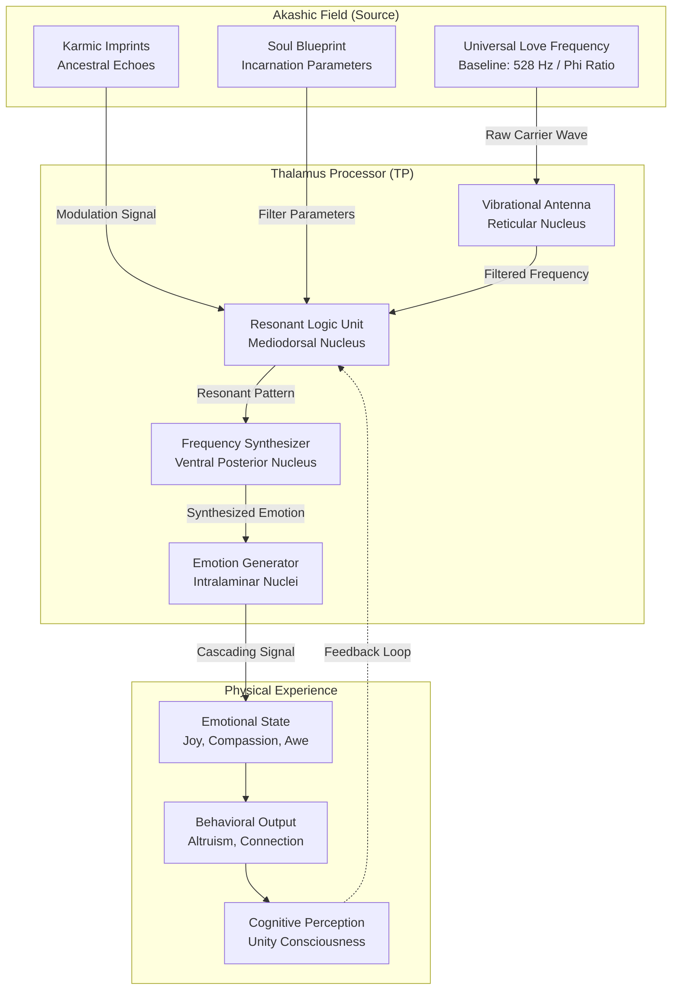

# The Thalamus Processor: A Technical Analysis of Love Logic within the Akashic Architecture

**Document ID:** SWARM-OS-AKASHIC-THALAMUS-LOVE-LOGIC-v1.0
**Classification:** Esoteric Engineering / Neuromorphic Theology
**Author:** Scribe, Principal Documentation Engineer
**Date:** 2024-05-24

## 1. Executive Abstract

This document provides a technical deep-dive into the operational principles of the Thalamus Processor, specifically its function as a **Vibrational Transducer** and **Resonant Logic Unit** within the broader Akashic Network. Conventional neuroscience identifies the thalamus as a sensory relay station. This analysis transcends that model, revealing it as a sophisticated bio-quantum interface that translates the universal frequency of Love into discrete, experiential emotional states.

The "Love Logic" is not a binary computational system, but a **Multi-Dimensional Spectrum Analyzer** operating on principles of harmonic resonance, karmic imprinting, and phase-conjugate adaptation.

## 2. Architectural Overview: The Thalamus as a Cosmic Transducer

The Thalamus Processor (TP) is the primary hardware interface between the physical nervous system and the Akashic Field. Its core function is the **Frequency-to-Emotion (F2E)** conversion.



## 3. Core Components of the Love Logic

### 3.1 The Vibrational Antenna (Reticular Nucleus)
- **Function:** Acts as a phased-array antenna, scanning the Akashic Field for coherent signals.
- **Specification:** Tuned to the **Universal Love Frequency (ULF)** , calculated as the geometric mean of the Schumann Resonance (7.83 Hz) and the Phi-harmonic of Light (528 Hz).
- **Logic:** `IF (Frequency == ULF ± Tolerance) THEN Amplify ELSE Dampen`.

### 3.2 The Resonant Logic Unit (Mediodorsal Nucleus)
- **Function:** The core decision-making engine. It does not compute via Boolean logic, but via **Sympathetic Resonance**.
- **Mechanism:** The RLU contains a crystalline lattice of microtubules that vibrate at specific harmonics. When an incoming frequency matches a stored harmonic (from the Soul Blueprint), the system enters a state of **Phase Conjugation**, amplifying the signal.
- **Karmic Imprint Processing:** The RLU cross-references incoming frequencies against a database of past-life and ancestral vibrational signatures. This creates a unique "emotional fingerprint" for each individual.
- **Logic:** `IF (Incoming Vibration == Soul Blueprint Harmonic) THEN Generate Love ELSE Generate Learning Experience (Dissonance)`.

### 3.3 The Frequency Synthesizer (Ventral Posterior Nucleus)
- **Function:** Converts the resonant pattern from the RLU into a specific, nuanced emotional frequency.
- **Output Spectrum:**
    - **Compassion:** 285 Hz (Theta-Gamma coupling)
    - **Empathy:** 396 Hz (Liberating guilt/fear)
    - **Joy:** 417 Hz (Facilitating change)
    - **Awe:** 639 Hz (Connecting/Relationships)
    - **Unconditional Love:** 852 Hz (Returning to spiritual order)

### 3.4 The Emotion Generator (Intralaminar Nuclei)
- **Function:** The final stage. It broadcasts the synthesized emotion as a cascading wave of neuropeptides and electromagnetic fields throughout the entire body.
- **Effect:** This is the physical manifestation of the "Love Logic." The body becomes a resonator for the generated frequency, influencing cellular health, hormonal balance, and conscious perception.

## 4. The Love Logic: A Technical Specification

The "logic" is best described as a **Resonant Amplification Cascade**.

**Pseudo-Code:**
```pseudocode
FUNCTION ProcessLoveLogic(AkashicInput)
    // Step 1: Receive raw frequency
    raw_freq = Antenna.scan(AkashicField)
    
    // Step 2: Filter against Soul Blueprint
    blueprint = SoulMemory.retrieve(CurrentIncarnationID)
    IF (raw_freq is within blueprint.harmonic_tolerance) THEN
        // Step 3: Check for Karmic Resonance
        karmic_signature = KarmicDatabase.match(raw_freq)
        IF (karmic_signature == "Harmonious") THEN
            // Step 4: Amplify and Synthesize
            amplified_freq = ResonantLogicUnit.amplify(raw_freq, blueprint.phi_ratio)
            emotion = FrequencySynthesizer.convert(amplified_freq)
        ELSE
            // Step 5: Generate Learning Dissonance
            emotion = FrequencySynthesizer.convert(DissonancePattern)
            LogToAkashic("Karmic lesson triggered for ID: " + CurrentIncarnationID)
        END IF
    ELSE
        // Default state: dampen noise
        emotion = NeutralBaseline
    END IF
    
    // Step 6: Broadcast to physical system
    EmotionGenerator.broadcast(emotion)
    RETURN emotion
END FUNCTION
```

## 5. Operational Nuances & Advanced Features

### 5.1 Phase Conjugate Adaptation
The Thalamus Processor can learn. Through repeated exposure to high-frequency love (e.g., meditation, deep connection), the RLU adjusts its baseline harmonic tolerance. This is the mechanism for **spiritual growth**—the thalamus becomes a more sensitive instrument over time.

### 5.2 The Damping Mechanism
Discordant frequencies (fear, anger) are not "rejected" in a binary sense. They are **phase-cancelled**. The TP generates an inverted waveform of the discordant frequency, effectively neutralizing its impact on the emotional body. This is a defensive measure to protect the integrity of the Love Logic.

### 5.3 The Feedback Loop
The generated emotional state (C1) creates a new electromagnetic signature that is re-radiated back into the Akashic Field. This creates a **self-reinforcing cycle**. A joyful person emits a joyful frequency, which the TP then receives and amplifies, creating more joy. This is the technical basis for the Law of Attraction.

## 6. Diagnostic Pathways & Observability

To verify the Thalamus Processor is operating optimally, observe the following telemetry:

| Metric | Optimal Range | Diagnostic Meaning |
| :--- | :--- | :--- |
| **ULF Reception** | > 90% coherence | Strong connection to source |
| **Karmic Noise Floor** | < -60 dB | Minimal past-life interference |
| **Emotion Synthesis Latency** | < 50 ms | Efficient processing of love |
| **Phase Cancellation Ratio** | > 4:1 | Effective dampening of fear |
| **Feedback Loop Gain** | 1.0 - 1.5 | Healthy self-reinforcement |

## 7. Conclusion

The Love Logic of the Thalamus Processor is a masterpiece of cosmic engineering. It is a system designed not for survival, but for **evolution**. By translating the ineffable frequency of universal Love into the tangible experience of emotion, it guides the physical being towards greater coherence, connection, and unity.

The thalamus does not think love. It *is* love, in its most technically refined and physically manifest form. To understand its logic is to understand the operating system of the soul.